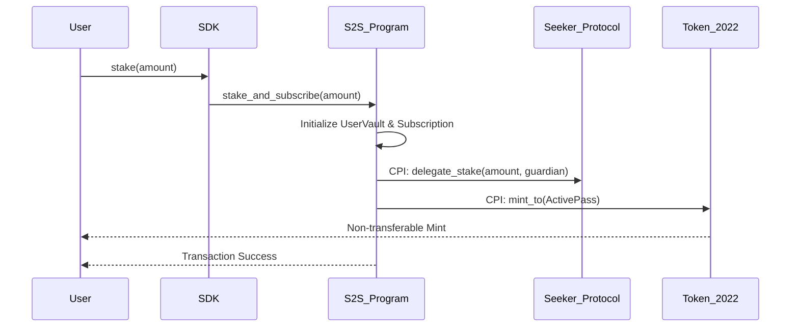
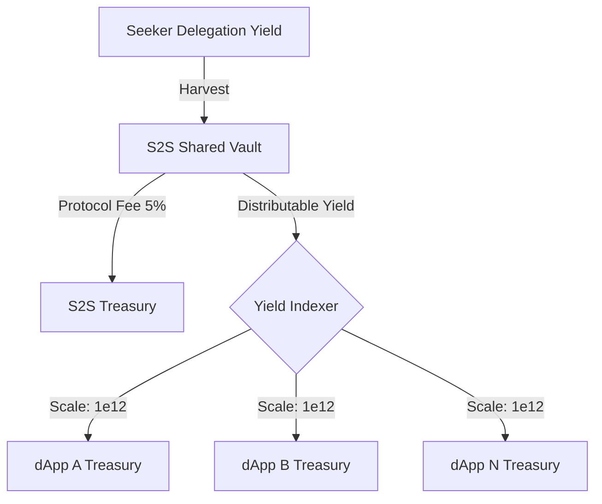

# S2S-Kit: Delegated Stake Subscription Protocol
### Non-custodial monetization for the Solana Seeker ecosystem.

S2S-Kit is a framework for implementing stake-based subscriptions on Solana. It enables dApp developers to capture yield from user deposits in the **Official Seeker Staking Protocol** while ensuring users maintain ownership of their principal.

---

## 🏗️ Technical Architecture

The protocol acts as a middleware layer between users and the official Solana Mobile $SKR staking program. It manages a multi-tenant vault system where user funds are delegated to high-yield Guardians via Cross-Program Invocations (CPI).

### 1. Staking and Authorization Flow
When a user stakes, the program initializes a `UserVault` and a `Subscription` account. It then performs a CPI to the Seeker protocol to delegate the user's $SKR to a designated Guardian.

### 2. Yield Redirection
Yield is realized when the program harvests delegation rewards from the Seeker protocol. The protocol calculates a global yield index to ensure fair distribution across all integrated dApps.

### 3. Unsubscription and Cooldown
To prevent yield manipulation and comply with the Seeker protocol's unbonding rules, the protocol enforces a 48-hour cooldown period. During this time, the user's Active Pass remains valid, but the staking principal is transitioning from a delegated to a liquid state.

---

## 🛡️ Protocol Security
*   **Non-Custodial**: Principal control is maintained via the `UserVault` PDA. Withdrawal is only possible to the original user authority after the unbonding period.
*   **Anchor 0.32**: Built using the latest Anchor framework with explicit instruction handlers to prevent namespace shadowing.
*   **Token-2022**: Utilizes the non-transferable extension to ensure subscription passes cannot be traded or moved between wallets.

---
*Built for the Seeker Ecosystem. Licensed under MIT.*
