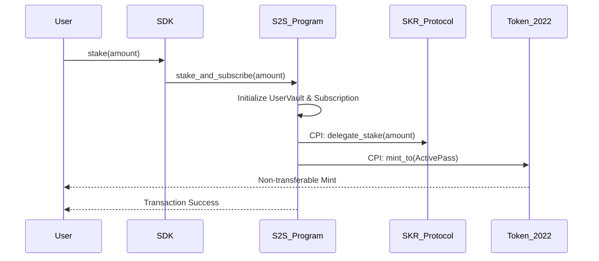
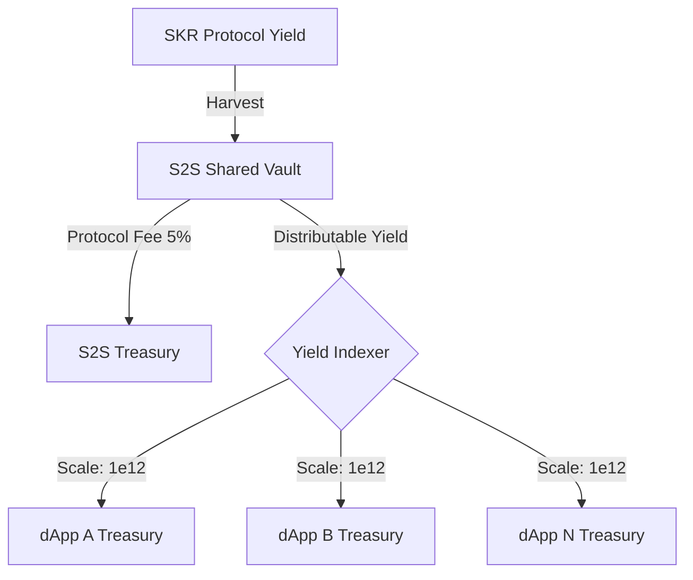

# S2S-Kit: Liquid Staking Subscription Protocol
### Non-custodial monetization for the Solana Seeker ecosystem.

S2S-Kit is a framework for implementing stake-based subscriptions on Solana. It enables dApp developers to capture yield from user deposits in the **SKR Liquid Staking Protocol** while ensuring users maintain ownership of their principal.

---

## 🏗️ Technical Architecture

The protocol acts as a middleware layer between users and the official Solana Mobile $SKR staking program. It manages a multi-tenant vault system where user funds are delegated to high-yield Guardians via Cross-Program Invocations (CPI).

### 1. Staking and Authorization Flow
When a user stakes, the program initializes a `UserVault` and a `Subscription` account. It then performs a CPI to the SKR protocol to delegate the user's $SKR.



### 2. Pro-rata Yield Distribution
Yield is realized when the program harvests rewards from the SKR protocol. The protocol calculates a global yield index to ensure fair distribution across all integrated dApps.



### 3. Unsubscription and Cooldown
To prevent yield manipulation, the protocol enforces a 48-hour cooldown period. During this time, the user's Active Pass remains valid, but the staking principal is transitioning to a liquid state.

---

## 🛠️ Developer Toolkit

### CLI Commands
The `@s2s-kit/cli` provides on-chain administrative capabilities:
*   `s2s init`: Scaffolds the project structure.
*   `s2s init-protocol --treasury <PUBKEY>`: Configures the global protocol state, including the Token-2022 pass mint and fee structure.
*   `s2s register-dapp --treasury <PUBKEY>`: Registers a unique dApp ID and treasury for yield routing.

### React SDK
The SDK abstracts the account resolution for the 17+ mandatory accounts required by the underlying SKR protocol.

```tsx
import { S2SProvider, useS2S } from '@s2s-kit/react';

// Wrap your app in the provider
const App = () => (
  <S2SProvider>
    <YourComponents />
  </S2SProvider>
);

const Feature = () => {
  const { status, stakeAndSubscribe } = useS2S();

  // Statuses: LOADING, ACTIVE, GRACE_PERIOD, UNSTAKING, EXPIRED, UNSUBSCRIBED
  if (status === 'UNSUBSCRIBED') {
    return <button onClick={() => stakeAndSubscribe(10e9, "DAPP_ID")}>Stake 10 SKR</button>;
  }

  return <PremiumContent />;
};
```

---

## 🛡️ Protocol Security
*   **Non-Custodial**: Principal control is maintained via the `UserVault` PDA. Withdrawal is only possible to the original user authority after the cooldown period.
*   **Anchor 0.32**: Built using the latest Anchor framework with explicit instruction handlers to prevent namespace shadowing.
*   **Token-2022**: Utilizes the non-transferable extension to ensure subscription passes cannot be traded or moved between wallets.

---
*Built for the Seeker Ecosystem. Licensed under MIT.*
