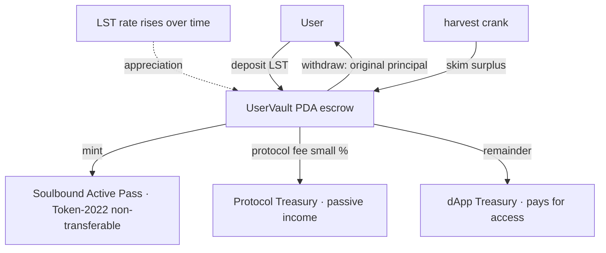

# S2S-Kit: Staking-Yield Routing for Solana

### Non-custodially point your LST yield at the things you value — keep your principal.

S2S-Kit is a primitive for **routing staking yield**. A user deposits a **Liquid Staking
Token (LST)** — jitoSOL, mSOL, bSOL, JupSOL, etc. — keeps full ownership of their
principal, and directs only the **yield** (the LST's appreciation) to a recipient they
choose. The principal is never spent and can be withdrawn at any time.

> **A standing order funded by your staking rewards, not your balance.**

Recipients can be **apps** (subscriptions / gated access), **creators** (patronage),
**DAOs** (membership, treasury), **public goods** (donate your yield, keep your capital),
or **yourself**. Subscriptions are the first app built on the primitive — see
[VISION.md](VISION.md) for the full framing.

---

## Why LSTs (and not native staking)

An LST is already a staked position whose value rises against SOL over time. That
means S2S-Kit needs **no CPI into any external staking program** — the yield is
simply the LST's exchange-rate appreciation, which is trivial to measure and
distribute. The result is a self-contained vault that is safe, auditable, and works
with any LST on Solana.

---

## How it works



### The money math (conservation-correct)

Everything is denominated and paid **in the LST itself**. For a vault:

```
principal_value           = deposit_amount × rate_at_deposit      (fixed, in SOL terms)
target_lst (at any rate)  = principal_value × 1e12 / current_rate
skim                      = deposited_lst − target_lst            (the appreciation)
protocol_fee              = skim × protocol_fee_bps / 10000        → protocol treasury
dapp_cut                  = skim − protocol_fee                    → dApp treasury
```

`skim = protocol_fee + dapp_cut`, and the vault is reduced by exactly `skim`, so **no
tokens are ever created or destroyed**. After a skim the vault still holds exactly the
user's principal value; on withdrawal that LST goes back to the user.

This invariant is proven by a runnable simulation and a randomized test — see below.

---

## Run the demo (no chain, no deployment, ~10 seconds)

You only need Node. This runs the exact integer math the on-chain program runs and
prints a full ledger:

```bash
node demo/realtime.mjs                        # ⭐ accelerated, screen-recordable: watch yield stream in real time
node demo/lifecycle.mjs                        # end-to-end lifecycle with a ledger + invariants
node middleware/aether-index/tests/math.test.js   # conservation tests incl. 2000 randomized paths
```

**Demoing despite slow real-world accrual:** real LST yield accrues at ~7% APY, so it
would show nothing for weeks. Because the LST `rate` is authority-controlled in v1, a demo
*fast-forwards* it — `demo/realtime.mjs` compresses 2 years into ~8 seconds, ticking the
rate up and harvesting each frame. On devnet you do the same with a demo LST mint and
scripted `update_lst_rate` calls, with `cooldown_seconds = 0` for instant withdrawals.

The lifecycle demo shows two users depositing jitoSOL, the rate appreciating over
several epochs, the crank skimming yield (protocol cut + recipient cut), and both users
withdrawing their **full original principal** — with fund conservation asserted at the end.

---

## Architecture

| Layer | Path | Role |
|---|---|---|
| On-chain program | [stake_to_subscribe/](stake_to_subscribe/) | Anchor 0.32 program: vaults, allowlist, harvest, pass |
| Pure-JS model | [demo/protocol.mjs](demo/protocol.mjs) | The same math, runnable in Node (powers the demo + tests) |
| Indexer | [middleware/aether-index/](middleware/aether-index/) | Decodes `UserVault` accounts and serves subscription status |
| React SDK | [sdk/s2s-react/](sdk/s2s-react/) | `useS2S()` — deposit / unsubscribe / withdraw hooks |
| UI kit | [packages/react/](packages/react/) | `SubscribeButton` with cooldown countdown |
| CLI | [packages/cli/](packages/cli/) | `init-protocol`, `add-lst`, `register-dapp` |

### On-chain instructions
- `initialize_protocol(fee_bps, treasury, cooldown_seconds)` — create config + the non-transferable pass mint
- `add_lst(initial_rate, rate_source)` — allow-list an LST
- `update_lst_rate(new_rate)` — refresh an LST's exchange rate (see *Rate source* below)
- `initialize_dapp(dapp_id, treasury, min_stake_value)` — register a dApp (value-based access gate)
- `deposit_and_subscribe(amount, dapp_id)` — escrow LST, mint pass
- `harvest_yield()` — permissionless crank that skims appreciation and pays out
- `initiate_unsubscribe()` / `withdraw()` — cooldown then reclaim principal

---

## Security & non-custodial guarantees

- **Non-custodial**: principal is escrowed in a `UserVault` PDA and only ever returns to
  the depositing wallet. Harvests can only move the *surplus above principal*.
- **Soulbound passes**: the Active Pass is a Token-2022 mint with the **NonTransferable**
  extension — it cannot be sold or moved between wallets.
- **Pinned accounts**: every token account is constrained by `mint` and `authority`
  (and treasuries to their registered owners), so no substituted-account attacks.
- **Checked arithmetic**: all value math uses `u128` intermediates and checked ops.

---

## Status & honest limitations

This repository is at a **demoable, type-checked** stage — not audited, not deployed.

- The Anchor program **type-checks** (`cargo check` passes). Running it end-to-end on a
  local validator requires the Solana + Anchor toolchain (`anchor test`); the program ID
  is a placeholder until you generate a real keypair and deploy.
- **Rate source:** v1 updates an LST's exchange rate via `update_lst_rate` (authority/oracle
  push). For production, `update_lst_rate` should read the LST's stake-pool state account
  (`rate_source`) and derive the rate on-chain as `total_lamports / pool_token_supply`.
- The bundled IDL (`sdk`/`cli`) is generated by [scripts/gen-idl.mjs](scripts/gen-idl.mjs);
  `anchor build` produces the canonical IDL once the toolchain is installed.
- Display metadata is not attached to the pass mint in v1 (the non-transferable guarantee is).

---

## License

Source-available under the **Functional Source License (FSL-1.1-MIT)** — see [LICENSE](LICENSE).
You can read, audit, fork, and build on it freely; what you **cannot** do is ship a
competing commercial product or service from it. Two years after each release, that
version converts automatically to the MIT license.

This protects the project's ability to define its own direction and monetization while
staying fully transparent. The on-chain `protocol_fee_bps` ships at **0** and is controlled
by the config **authority** — the right to enable a fee later is retained by the deployer,
not granted to forks.
